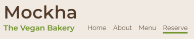
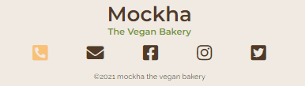
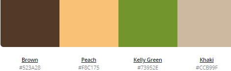
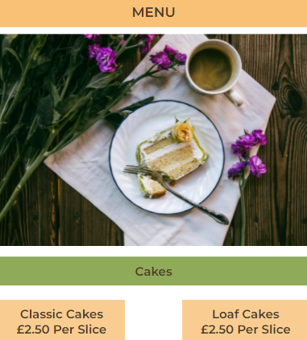

# Mockha

Mockha is a site targeting consumers who are willing to explore vegan cake and coffee. The goal of the site is to promote a vegan bakery where customers can socialise over coffee and cake. The site allows visitors to view the menu to see what is on offer and then make a reservation if they wish to do so.

## Design 

The website has been designed using the width size of a medium mobile screen device, minimum width of 370px (mobile first design approach). The website incorporates reponsive font-sizes, widths and heights using units such as root m (rem), viewport height (vh) and viewport width (vw).

## Features common to all pages

### Header
* Logo
    *  The logo consists of the company name and a subheading  which gives users an idea about the content of the website at a glance. The logo appears consistently across all pages.  
* Navigation menu 
    * The navigation menu appears consistently on all four pages of the web site allowing users to easily navigate to the four different pages, namely Home, About, Menu and Reserve.
    * When the user hovers over the menu items the items are highlighted and when the user is on a particular page the menu item is underlined, this helps users to easily navigate across the website.

### Footer 
* Logo
    * The logo is present again in the footer as a reminder of the bakery name.
* Contact details
    * Contact number, email and social media links have been denoted using an icon, which change colour when a user hovers over them and when clicked directs the user to the appropriate location. 
        * Phone icon - when clicked the user is given the option to make a call immediately which means users do not need to dial the number.
        * Email icon - when clicked an email pop up appears with the 'to' correspondence automatically filled in allowing the user to initiate and send an email to the company more efficiently. 
        * Facebook, Instagram and Twitter icons - when clicked directs the user to the relevant social media location
* Copyright details
    * Copywright details have also been added into the footer section, as commonly the practice. 

### Colour 
* There are four main colours used throughout this website and the inspiration behind these came from the website, [canva](https://www.canva.com/colors/color-palette-generator/). The colour palette is called 
afternoon craving and it consists of four colours, namely Brown (#523a28) Peach (#f8c175), Kelly Green (#73952e) and Khaki (#ccb99f).
* The text colour is brown across all pages.
* The header and footer have background colour of a shade of khaki.
* The headings inside the pages have been given a background colour of a shade of peach or green.
* In the body of the text, where a slightly transparent shade of one of the colour palette colours was required, the website [coding.tools](https://coding.tools/hex-to-rgba) was used to provide a RGBA colour alternative. 

### Font 
* There are two main fonts used in this website and they are Montserrat, semi-bold 600 for all headings and Raleway regular 400 for the body text. The font was sourced from [google fonts](https://fonts.google.com/). 
* In circumstances where the preferred font fails to load, the fall back font specified is sans-serif.

### Headings 
* The heading-3 text that appears first after the logo is set against a peach background with brown uppercase text - this is to emphasis the purpose of the page 
* The heading-4 texts are set against a green background and the letters of each word are capitalized to emphasis the start of a new section.
* The heading-5 texts are set against a more transparent peach background and the letters of each word are also capitalized to depict a sub-heading and highlight key information.     

    * Margins 
        * The margin for the entire website is set 

## Features that are page specific

### Landing page 
* Slogan 
    * The slogan is short yet catchy in order to help users remember the bakery. 
* Hero image 
    * The hero image summarizes the products sold at mockha; coffee and cake. This specific image was used to tempt the user into finding out more about the products. 
* Cake and Coffee images
    * Below the hero image there are two images of cake and coffee with clickable headings inviting users to explore the cake and coffee menus.
* Review 
    * There is a review given at the bottom of the home page in order to further convince users about visiting or making a reservation with Mockha.

