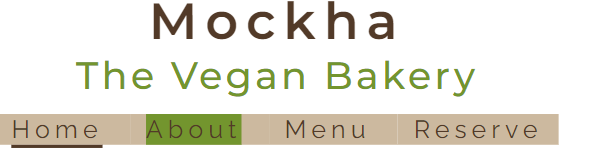

# Mockha

Mockha is a site targeting consumers who are willing to explore vegan cake and coffee. The goal of the site is to promote a vegan bakery where customers can socialise over coffee and cake. The site allows visitors to view the menu to see what is on offer and then make a reservation if they wish to do so.

## Features common to all pages

### Header
* Logo
    *  The logo consists of the company name and a subheading  which gives users an idea about the content of the website at a glance. The logo appears consistently across all pages.  
* Navigation menu 
    * The navigation menu appears consistently on all four pages of the web site allowing users to easily navigate to the four different pages of the website, namely Home, About, Menu and Reserve.

### Footer 
* Logo
    * The logo is present again in the footer as a reminder of the bakery name.
* Contact details
    * Contact number and email address have been provided in the footer for convenience, as well as the icons representing phone and email, to make them visually noticable.
* Social media 
    * Social media links to facebook, twitter and instagram have been provided in the form of clickable icons, with aria labels to accomodate visually impaired users. 

### Colour palette
* There are four main colours used throughout this website and the inspiration behind these came from the website, [canva](https://www.canva.com/colors/color-palette-generator/). The colour palette is called 
afternoon craving and it consists of four colours, namely Brown (#523a28) Peach (#f8c175), Kelly Green (#73952e) and Khaki (#ccb99f).

* In the body of the text, where a slightly transparent shade of one of the colour palette colours was required, the website [coding.tools](https://coding.tools/hex-to-rgba) was used to provide a RGBA colour alternative. 

### Font 
* There are two main fonts used in this website and they are Montserrat, semi-bold 600 for all headings and Raleway regular 400 for the body text. The font was obtained from [google fonts](https://fonts.google.com/)

## Features that are page specific

### Landing page 
* Slogan 
    * The slogan is short yet catchy in order to help users remember the bakery. 
* Hero image 
    * The hero image summarizes the products sold at mockha; coffee and cake. This specific image was used to tempt the user into finding out more about the products. 
* Cake and Coffee images
    * Below the hero image there are two images of cake and coffee with clickable headings inviting users to explore the cake and coffee menus.
* Review 
    * There is a review given at the bottom of the home page in order to further convince users about visiting or making a reservation with Mockha.

