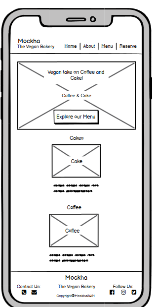
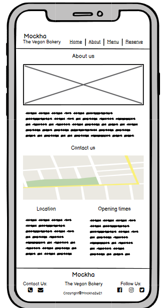
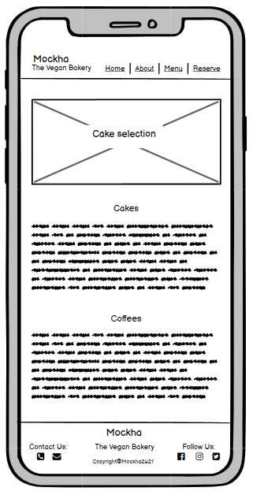
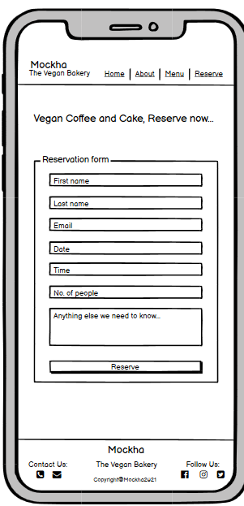
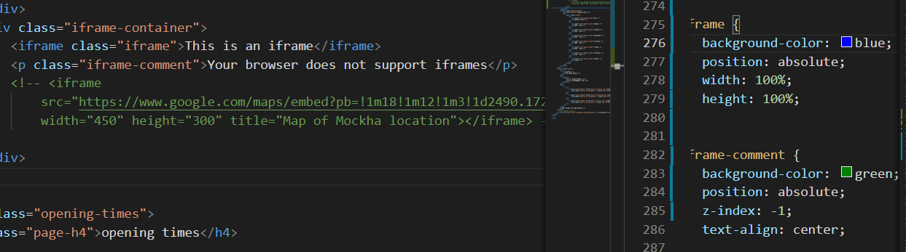
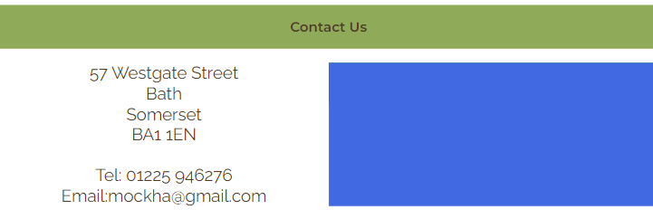
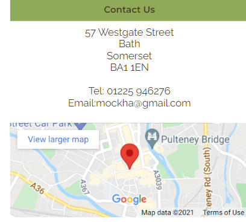

# Mockha

Mockha is a site targeting consumers who are willing to explore vegan cake and coffee. The goal of the site is to promote a vegan bakery where customers can socialise over coffee and cake. The site allows visitors to view the menu to see what is on offer and then make a reservation if they wish to do so.

## Design 

The website has been designed using the width size of a medium mobile screen device, minimum width of 370px (mobile first design approach). The website incorporates reponsive font-sizes, widths and heights using units such as root m (rem), viewport height (vh) and viewport width (vw).

### Wireframes 
* Below are the wireframes that I created at the start of this project, in a mobile phone viewport:

Home page : 

About page:

Menu page:

Reserve page:

## Features common to all pages

### Header
* Logo
    *  The logo consists of the company name and a subheading  which gives users an idea about the content of the website at a glance. The logo appears consistently across all pages.  
* Navigation menu 
    * The navigation menu appears consistently on all four pages of the web site allowing users to easily navigate to the four different pages, namely Home, About, Menu and Reserve.
    * When the user hovers over the menu items the items are highlighted and when the user is on a particular page the menu item is underlined, this helps users to easily navigate across the website.

### Footer 
* Logo
    * The logo is present again in the footer as a reminder of the bakery name.
* Contact details
    * Contact number, email and social media links have been denoted using an icon, which change colour when a user hovers over them and when clicked directs the user to the appropriate location. 
        * Phone icon - when clicked the user is given the option to make a call immediately which means users do not need to dial the number.
        * Email icon - when clicked an email pop up appears with the 'to' correspondence automatically filled in allowing the user to initiate and send an email to the company more efficiently. 
        * Facebook, Instagram and Twitter icons - when clicked directs the user to the relevant social media location
* Copyright details
    * Copywright details have also been added into the footer section, as commonly the practice. 

### Colour 
* There are four main colours used throughout this website and the inspiration behind these came from the website, [canva](https://www.canva.com/colors/color-palette-generator/). The colour palette is called 
afternoon craving and it consists of four colours, namely Brown (#523a28) Peach (#f8c175), Kelly Green (#73952e) and Khaki (#ccb99f).
* The text colour is brown across all pages.
* The header and footer have background colour of a shade of khaki.
* The headings inside the pages have been given a background colour of a shade of peach or green.
* In the body of the text, where a slightly transparent shade of one of the colour palette colours was required, the website [coding.tools](https://coding.tools/hex-to-rgba) was used to provide a RGBA colour alternative. 

### Font 
* There are two main fonts used in this website and they are Montserrat, semi-bold 600 for all headings and Raleway regular 400 for the body text. The font was sourced from [google fonts](https://fonts.google.com/). 
* In circumstances where the preferred font fails to load, the fall back font specified is sans-serif.

### Headings 
* The heading-3 text that appears first after the logo is set against a peach background with brown uppercase text - this is to emphasis the purpose of the page 
* The heading-4 texts are set against a green background and the letters of each word are capitalized to emphasis the start of a new section.
* The heading-5 texts are set against a more transparent peach background and the letters of each word are also capitalized to depict a sub-heading and highlight key information.     

### Images 
* Besides the home page, which has two images, all other pages have a content-related image at the start of the page to tempt the user into reading on and each of those images have a heading to explain the purpose of the page.

    * Margins 
        * The margin for the entire website is set 

## Features that are page specific

### Home page 
* This page is primarily separated into three sections (not including header or footer):
    * Section 1 - Slogan and Hero-image
        * The slogan, "Vegan Take On Coffee and Cake", is short yet catchy in order to help users remember the bakery. 
        * The hero image summarizes the products sold at mockha; coffee and cake. This specific image was used to tempt the user into finding out more about the products. 
    * Section 2 - Cake and Coffee images
        * Below the hero image there are two images of cake and coffee with clickable headings requesting users to explore the cake and coffee menus.
    * Section 3 - Testimonials
        * There are two testimonials given at the bottom of the home page to further convince users about visiting or making a reservation with Mockha.

### About page 
* This page is primarily separated into three sections (not including header or footer):
    * Section 1 - Page heading and image 
        * The purpose of this has been explained in an earlier section (see images section)
    * Section 2 - Welcome 
        * Provides background information about the owners of the bakery and their ethos so users can develop an insight about the bakery.
    * Section 3 - Contact us 
        * Provides an address and map of the location of the bakery (map used in iframe taken from [google maps](https://www.google.co.uk/maps) so users can locate the bakery easily
    * Section 4 - Opening times 
        * Provides a tabulated form of the bakery's opening times on a daily basis, in order to provide clarity to the user.

### Menu page 
* This page is primarily separated into three sections (not including header and footer):
    * Section 1 - Page heading and image 
        * The purpose of this has been explained in an earlier section (see images section).
    * Section 2 - Cakes 
        * Provides a list of all cakes and their prices, so users can get a clear idea as to what cakes are being sold at Mockha and what prices they should expect.
    * Section 3 - Coffee 
        * Provides a list of coffees and their prices in a tabulated form, so users can get an idea of what to expect. 

### Reserve page 
* This page is primarily separated into two sections(not including header and footer):
    * Section 1 -  Page heading and image 
        * The purpose of this has been explained in an earlier section (see images section).
    * Section 2 - Reservation form 
        * Provides a means as to which users can make a reservation at the bakery to ensure that the bakery is well-informed about the customers requirements.
        * Users are prompted to ensure all mandatory fields are completed should they miss out any necessary fields. 

## Features for the future 
To add an order form allowing users to make an order from the bakery with photos of the items they can choose to order.

## Testing 

#### Interactive feature testing
The features of my code that require user interactivity are:
* The navigation menu 
    * I have checked through each page to ensure when hovered over, each item changes colour on each page. 
    * I have checked that the current page is always underlined for each page. 
    * All pages work fine.
* The footer 
    * I have checked that when the contact phone and email and social media links are hovered over they change colour.
    * I have checked each icon on each page to ensure that they go to the correct location
    * All pages work fine
    * The call-to-action links to the Menu page from the home page
    * I have checked that these both link to the right page 
    * I have checked that once clicked, these links do not change their original colour, through the implentation of the 'visited' pseudo class.
    * Both links work fine
* The iframe map
    * I have checked this map appears on each browser view and can be clicked on if the user wanted to review the map area closely.
        * This works fine.
* The reservation form in the reserve page 
    * I have checked each field entry where a text or number input is required to ensure that an entry can be written inside and that there is sufficient space.
    *  I have checked the date input field and the time select field to ensure that they display the correct information. 
    * I have checked the radio buttons to ensure that only one is able to be selected. 
    * I have reviewed the checkbox buttons to ensure more than one box can be selected at any time.
    * I have also tried to deliberately leave out fields on submitting for the form to check that the form does not submit and highlights the fields that require completing.
    * All fields work as they should.

#### Bugs encountered 
* Iframe map
    * I had a paragraph statement to display only if the iframe was not supported by a browser, however, the paragraph element was always appearing below the iframe, therefore in order to make it visible, i was advised by Codeinstitute Tutor Support to perhaps consider using z-index. 
    * After a few trial attempts to try and get the positioning right, this issue was resolved.
    * See below the trials that I carried out to get the positioning right and a final screenshot of the actual iframe map. 

* Reservation Form layout 
    * I initially used block elements to create the form, however, when upon inspecting the form on different viewport widths, the form components were not staying in place.
    * I decided to use flex box instead as I had used this before to create both the header and footer elements and it worked fine.

* Footer positioning 
    * Upon review of my website with my Codeinstitute Mentor, it was noticed that my footer was not being positioned permanently at the bottom of the page.
    * Upon reviewing a few webpages and youtube links, I came across a youtube video by [Dani Krossing Keep the Footer at the Bottom](https://youtu.be/qlCIXXhSX6Y) which I followed to keep my footer at the bottom of the page. 

* Phone and Email icons to instigate call or email 
    * I wanted to keep my footer simple by only having icons at the bottom for contact links and social media. 
    * For social media links, I referred back to the Love Running Project by [Codeinstitute](https://codeinstitute.net/5-day-coding-challenge/?gclsrc=aw.ds&&hsa_net=adwords&hsa_tgt=kwd-71743597220113:loc-188&hsa_ad=&hsa_acc=8983321581&hsa_grp=1147890658588794&hsa_mt=e&hsa_cam=1578649861&hsa_kw=code%20institute&hsa_ver=3&hsa_src=o&msclkid=6627ac8253bf1cd6e563cc3793fc117d&utm_source=bing&utm_medium=cpc&utm_campaign=a%26c_SEA_UK_BR_Brand_Code_Institute&utm_term=code%20institute&utm_content=exa_Brand) 
    * I was unsure about how this would be done for phone and email, although knew it was possible from viewing other web pages. To help with this i used the following websites [Gaintap](https://www.gaintap.com/archived/clickable-website-phone-number-and-call-tracking-guide) and [Wikihow](https://www.wikihow.com/Create-an-Email-Link-in-HTML).
* Positioning header, footer, forms and cake lists
    * I found it a struggle to position elements side by side using only in-line block elements as the elements kept on moving out of position if the viewport was enlarged, therefore I looked up another method and came across the website [CSS-tricks](https://css-tricks.com/snippets/css/a-guide-to-flexbox/) which was fantastic at explaining the principles of flex box, which I have used to position the above components of my web page. 
